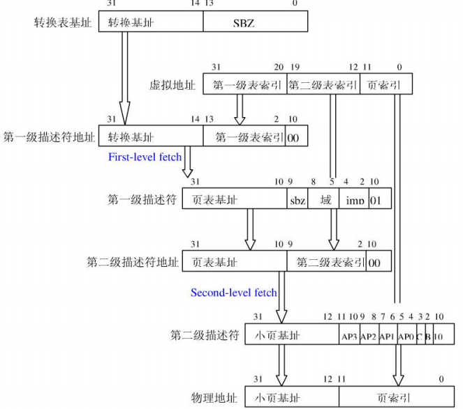

Cache & MMU
=============

* Author：Jianing Ren
* Email: jianing.ren@rock-chips.com
* Data: 2019.7.24

[toc]

## 一、Cache培训文档

### 1.1 cache的基本框图

Cache是缓存，介于中央处理器和主存储器之间的高速小容量存储器。Cache主要由三大部分组成：

* Cache存储体：存放由主存调入的指令与数据块。
* 地址转换部件：建立目录表以实现主存地址到缓存地址的转换。
* 替换部件：在缓存已满时按一定策略进行数据块替换，并修改地址转换部件。

Cache的基本原理如下图所示：


其中Cache的基本组成单元为Cache Line:


* Tag: tag为虚拟地址（或物理地址）的最高位域，结合set index和data index用来判断该存储单元对应的主存位置
* Bit_v(valid): 有效位，用来表识该cache line是否可用。通过清除该位可以清除该cache line
* Bit_d(dirty): 脏位，用来标识该cache line中的数据是否和主存中数据一致，在一个cache line的多个存储单元中，只要有一个存储单元的数据和主存不一致，该位就会给设置。当用write back方式向cache line写入数据时，该cache line的的d位被设置，将这种cache line替换出cache时，必须先“清理”该cache line，否则将造成数据丢失。
* Words: Cache中存储数据的部分。
* Data index: Cache line中数据项段部分中所有数据相对于最低位字节数据的偏移

#### 为什么使用Cache

* 解决CPU与存储器速度不匹配的问题
* 程序访问的局限性
	* 时间局部性: 一个存储项被访问,可能很快再访问.
	* 空间局部性: 存储项被访问,它的邻近项可能很快被访问.

在一个较短的时间间隔内，由程序产生的地址往往集中在存储器逻辑地址空间的很小范围内。指令地址的分布本来就是连续的，再加上循环程序段和子程序段要重复执行多次。因此，对这些地址的访问就自然地具有时间上集中分布的倾向。

数据分布的这种集中倾向不如指令明显，但对数组的存储和访问以及工作单元的选择都可以使存储器地址相对集中。这种对局部范围的存储器地址频繁访问，而对此范围以外的地址则访问甚少的现象，就称为程序访问的局部性。

根据程序的局部性原理，可以在主存和CPU通用寄存器之间设置一个高速的容量相对较小的存储器，把正在执行的指令地址附近的一部分指令或数据从主存调入这个存储器，供CPU在一段时间内使用。这对提高程序的运行速度有很大的作用。

#### Cache的分类

从Cache的位置可以将Cache分为：

* 逻辑Cache（虚拟Cache): 在虚拟地址空间中存储数据,它位于处理器和MMU之间.处理器可以直接通过逻辑cache访问数据,而无须通过MMU. 
* 物理cache: 使用物理地址存储数据,它位于MMU和主存之间.当处理器访问存储器时,MMU必须先把虚拟地址转换成物理地址,cache存储器才可以向内核提供数据.

> 从arm7～arm10都是使用逻辑cache，arm11使用物理cache。
> 
> 直接用虚拟地址访问,在命中时可以省去虚实地址转换的时间。然而一般在设计时并非都采用虚拟，这是因为每当系统进行进程切换时，由于新进程的虚拟地址,有可能与原进程的相同，所指向的物理空间与原进程的不同。即同一虚拟地址会指向不同的物理地址，同样也会产生同一物理地址有不同的虚拟地址来访问。它们可能会导致同一数据在虚拟中有不同的副本。则当其中一个被修改，再使用另一个数据就会产生出错。

从用途来说又可以分为：

* ICache 指令缓存
* DCache 数据缓存

#### Cache的基本结构

根据主存与Cache的映射关系可以分为直接映射Cache，组相关Cache和全相关Cache

* **直接映射Cache**: 主存中的每一个块只能被放置到 Cache 中唯一的一个位置。为Cache中的每个块位置分配一个索引字段，用Tag字段区分存放在Cache位置上的不同的块。
	* 优点：能进行快速查找。
	* 缺点：当主存储器的组之间做频繁调用时，Cache控制器必须做多次转换。


* **组相联Cache**: 组相联是指主存中的每一块可以被放置到 Cache 中唯一的一个组中的任何一个位置（Cache 被等分为若干组，每组由若干个块构成）
	* 优点：块的冲突概率比较低，块的利用率大幅度提高，块失效率明显下降。
	* 缺点：实现难度和造价高。


* **全相联Cache**: 主存的任意一块可以映象到Cache中的任意一块。Cache保存着互不相关的数据块（存储块和块自身的地址）。当请求数据时，Cache控制器要把请求地址同所有地址加以比较，进行确认。
	* 优点：能够在给定的时间内去存储主存器中的不同的块，命中率高。  
	* 缺点：每一次请求数据同Cache中的地址进行比较需要相当的时间，速度较慢。


### 1.2 Cache writeback 和 writethrough

#### Cache的读操作

当CPU试图读取主存一个字时，发出此字内存地址同时到达cache和主存，此时cache控制逻辑依据地址的标记部分进行判断此字当前是否在cache中。

* 命中：此字立即递交给CPU。
* 未命中：则要用主存读取周期把这个字从主存读出送到CPU，与此同时把含有这个字的整个数据块从主存读出送到cache中。


#### Cache有三种失效

* 强制性失效： 当第一次访问一个块时，该块不在Cache中，需从下一级存储器中调入Cache。
* 容量失效： 如果程序执行时所需的块不能全部调入Cache中，则当某些块被替换后，若又重新访问，就会发生失效。
* 冲突失效： 在组相联或直接相联中，若太多的块映像到同一组（块）中，则会出现该组中某个块被别的块替换（即使别的组或块有空闲位置），然后又被重新访问的情况。

#### Cache的写操作

* Write Through:  CPU向cache写入数据时，同时向memory(后端存储)也写一份，使cache和memory的数据保持一致。
	* 优点：简单
	* 缺点：每次都要访问memory， 速度比较慢。


* Write Back:  考虑到很多时候cache存入的是中间结果,没有必要同步更新memory。只是写到cache里，memory的内容要等到cache保存的要被别的数据替换或者系统做cache flush时，才会被更新。
	* 优点：是CPU执行的效率提高
	* 缺点：是实现起来技术比较复杂。


* Cache写策略的比较

|    写策略    | 复杂度 | 通信量 | 可靠性 |
|:-----------:|:-----:|:-----:|:-----:|
|Write Through|  简单  |  少  |   可靠  |
|Write Back   |  复杂  |  多  |  不可靠 |

### 1.3 invalid 和 clean

* Flush (invalidate)：清除cache的意思是清除cache中存储的全部数据。对处理器而言，清除操作只要清零相应cache行的有效位即可。当存储器配置上有变化时，整体或部分cache可能需要进行清除操作。有时也用术语作废（invalidate）来代替术语“清除”。
* clean： 清理cache的意思是把脏的（即被改写过的）cache行强制写到主存，并把cache行中的脏位清零。清理cache可以重建cache与主存之间的一致性

### 1.4 Cache性能和什么参数有关

#### 从三个方面改进Cache的性能

* 降低失效率
* 减少失效开销
* 减少Cache命中时间

具体参数包括：

* Cache容量： 容量增加，失效率降低，容量失效和冲突失效次数减少，强制性失效增加
* 相联度： 相联度增加，失效率降低，容量失效和冲突失效次数减少，强制性失效增加
* 块大小： 块大小增加，失效率降低，容量失效和冲突失效次数增加，强制性失效减少
* 替换策略： 最近最少使用策略（LRU）相对较好

#### Cache的替换

在从主存读出新的字块调入Cache时,如果遇到Cache中相应的位置已被其他字块占有,那么就必须去掉一个旧的字块,让位于一个新的字块. 这种替换应该遵循一定的规则,最好能使被替换的字块是下一段时间内估计最少使用的. 这些规则称为替换策略或替换算法,由替换部件加以实现.

* 替换算法：随机、轮询、LRU……

> 嵌入式处理器为了尽可能减少芯片的面积-没有采用效率较高.电路较复杂的LRU算法-而是采用电路比较简单轮转法

#### Cache的锁定

Cache锁定是将cache中的部分代码和数据标记为非替换(exempt of eviction)的。被锁定的代码和数据有更快的系统反应能力，因为这些数据和代码一直存放在cache中。

### 1.5 DMA从DDR搬移数据到外设，cache需要做什么操作？

进行DMA操作时，如果没有对Cache 进行适当的操作，将可能产生以下两种错误

* DMA 从外设读取数据到供处理器使用。DMA 将外部数据直接传到内存中，但cache 中仍然保留的是旧数据，这样处理器在访问数据时直接访问缓存将得到错误的数据。 
* DMA 向外设写入由处理器提供的数据。处理器在处理数据时数据会先存放到cache 中，此时cache 中的数据有可能还没来得及写回到内存中的数据。如果这时DMA 直接从内存中取出数据传送到外设，外设将可能得到错误的数据。

**可先进行writeback 操作。这样可以DMA传输数据之前先将缓存中的数据写回到内存中。**

### 1.6 DMA从外设搬移数据到DDR，cache需要做什么操作？

**可先进行invalidate 操作。这样将迫使处理器在读取cache中的数据时，先从内存中读取数据到缓存，保证缓存和内存中数据的一致性。**

> 如果不清楚DMA 操作的方向，也可先同时进行invalidate 和writeback 操作。操作的结果等同于invalidate 和 writeback 操作效果的和。

## 二、MMU培训文档

### 2.1 MMU的基本框图

#### 相关概念

* 地址范围

任何时候，计算机上都存在一个程序能够产生的地址集合，我们称之为地址范围。

这个范围的大小由CPU的位数决定，例如一个32位的CPU，它的地址范围是0~0xFFFFFFFF (4G),这个范围就是我们的程序能够产生的地址范围，我们把这个地址范围称为虚拟地址空间，该空间中的某一个地址我们称之为虚拟地址。与虚拟地址空间和虚拟地址相对应的则是物理地址空间和物理地址，大多数时候我们的系统所具备的物理地址空间只是虚拟地址空间的一个子集；

例如对于一台内存为256MB的32bit x86主机来说，它的虚拟地址空间范围是0~0xFFFFFFFF（4G）,而物理地址空间范围是0x000000000~0x0FFFFFFF（256MB）。

* 分页机制

虚拟地址空间划分成称为页（page）的单位，而相应的物理地址空间也被进行划分，单位是页帧(frame).页和页帧的大小必须相同。

* 地址分类

ARM CPU上的地址转换过程涉及3个概念：虚拟地址（VA,Virtual Address）、变换后的虚拟地址（MVA,Modified Virtual Address）,物理地址（PA，Physical  Address）

没启动MMU时，CPU核、cache、MMMU、外设等所有部件使用的都是物理地址。

启动MMU后，CPU核发出虚拟地址VA：VA转换为MVA供cache、MMU使用，在这里MVA被转换为PA；最后使用PA读写实际设备

VA和MVA的转化关系是：

```
if (VA  < 32M) then
        MVA = VA | (PID <<25)
else
        MVA = VA
```

其中PID为进程标识号（通过读CP15的C13获得）。使用MVA，而不使用VA的目的是：当有重叠的VA时，转换后的MVA地址并不重叠，减小转换为PA的代价

>1. CPU核看到的、用到的只是虚拟地址VA，至于VA如何最终得到落实物理地址PA上，CPU核实不理会的。
2. 而caches和MMU也是看不见VA的，它们利用有MVA转换得到PA。
3. 实际设备看不到VA、MVA,读写它们时使用的是物理地址PA。
4. MVA是除cpu核外的其他部分看不见的虚拟地址。（下面说到的虚拟地址，没特别说明都是MVA）

* TLB和地址转化表
	* TLB(translation lookaside buffer) 转换遍历缓存。
TLB是MMU的核心部件，它存储少量的虚拟地址与物理地址的转换关系，它其实是物理内存区的一小段内存。TLB是位于内存中的页表的cache，如果没有TLB，则每次取数据都需要两次访问内存,即查页表获得物理地址和取数据. 
	* 地址转换表。 
当TLB中没有缓冲对应的地址转换关系时，需要查找这个地址转换表，找到虚拟地址与物理地址的对应关系。在大多数处理器中，这个转换表为多级页表。

* CP15寄存器 - 与MMU有关的寄存器
	* CP15的C2寄存器，该寄存器保存的是页表的基地址，即一级映射描述符表的基地址。其编码格式如下图所示
	
	<div align="center">  
	
	</dev>
	
	* CP15的C8寄存器，用来控制清除TLB的内容，是只写寄存器，读操作将产生不可预知的后果。
	* CP15的C10寄存器，用于控制TLB内容锁定。如果系统中包含独立的指令TLB和数据TLB，那么对应于数据TLB和指令TLB分别有一个独立的TLB内容锁定寄存器，<opcode_2>用来选择其中的某个寄存器
	* CP15的C5寄存器，该寄存器是失效状态寄存器，编码格式如下图所示，其中域标识bit[7:4]表示存放引起存储访问失效的存储访问所属的域

	<div align="center">  
	
	</dev>


#### MMU的主要功能

* 负责硬件机制的内存访问权限
* 负责虚拟地址(MVA)映射为物理地址
* 管理虚拟储存器物理储存器的控制线路（高速缓存和缓冲位）

现代的多用户多进程操作系统，需要MMU才能达到每个用户进程都拥有自己独立的地址空间的目标。使用MMU,操作系统划分出一段地址区域，在这块地址区域中，每个进程看到的内容都不一定一样。例如 WINDOWS操作系统将地址范围4M-2G划分为用户地址空间，进程A在地址0X400000（4M）映射了可执行文件，进程B同样在地址0X400000（4M）映射了可执行文件，如果A进程读地址0X400000，读到的是A的可执行文件映射到RAM的内容，而进程B读取地址0X400000时，则读到的是B的可执行文件映射到RAM的内容。




### 2.2 一级页表和二级页表映射原理

#### 页表相关概念

* 页表：存在内存中的地址转换表，页表由一个个条目(描述符)组成
* 条目：每个条目存储了一段虚拟地址对应的物理地址及其访问权限，或者下一级页表地
* 页号：从页表基址开始，每页的索引号
* 页内偏移：某一页的内部偏移地址
* 转换表基址（TTB base）：代表第一级页表的地址，将它写入协处理器CP15的寄存器C2 （称为页表基址寄存器）即可。

#### ARM MMU硬件采用2级页表结构：一级页表（L1）和二级页表（L2）

* 以段（Section）的方式进行转换: 只用到L1，构成1MB的存储器块
* 以页(Page)的方式进行转换: 用到L1和L2
* 第一级页表的地址必须是16K对应的（位[14:0]为0）地址，因为虚拟地址的前12位是L1的索引，L1的大小固定为 2^12 Words 即16KB。
* L1描述符支持四种类型页表项
	* 没有被映射 Fault，试图访问将产生转换错误
	* 粗页表 Coarse Page table
	* 细页表 Fine Page table
	* 段描述符 Section entry


* L2描述符支持三种Page
	* 微页（Tiny page）:构成1KB的存储器块
	* 小页（Small page）:构成4KB的存储器块
	* 大页（Large page）:构成64KB的存储器块


#### 转换过程:

1. 根据给定的虚拟地址找到一级页表中的条目
* 如果此条目是段描述符，则返回物理地址，转换结束
* 如果此条目是二级页表描述符，继续利用虚拟地址在二级页表中找到下一个条目;
* 如果这第二个条目是页描述符，则返回物理地址，转换结束;
* 其他情况出错

> 注意：虚拟地址转换为物理地址，实际就是一个读取页表的过程，所以在转换之前要保证已经创建好了页表


#### 页表映射实例

* 以段方式转换


* 粗页表小页转换
  



虚拟地址（MVA）代表含义

| 转换方式 | L1索引 | L2索引 | 页(段)内偏移 |
|:-------:|:-----:|:-----:|:---------:|
|段|12bits| |20bits|
|大页|12bits|4bits (16项)|16bits (64KB)|
|小页|12bits|8bits (256项)|12bits (4KB)|
|微页|12bits|10bits (1k项)|10bits (1KB)|

### 2.3 权限控制

内存的访问权限检查是MMU的主要功能之一，简单的说，它就是决定一块内存是否允许读、是否允许写。访问权限控制是由以下部分联合作用的。

* CP15寄存器C3（域访问控制）
* 描述符的域（Domain）
* CP15寄存器C1的R/S/A
* 描述符的AP位

CP15寄存器C1中的A位表示是否对地址进行对齐检查。

所谓对齐检查就是，例如访问字（4字节的数据）时是否为4字节对齐，如果地址不对齐则产生“Alignment fault”异常。Cpu读取指令时不进行对齐检查，以字节为单位访问时也不进行对齐检查。对齐检查在MMU的权限检查、地址映射前进行。

内存的访问权限检查可以概括为一下2点：

* “域”决定是否对模块内存进行权限检查
* “AP”决定如何对某块内存进行权限检查

CP15寄存器C3中每两位对应一个域（一共16个域），用来表示这个域是否进行权限检查

| 域(2bits) | 含义 |
|:------:|:------------------------------------:|
| 00 | 无访问权限(任何访问都将导致“Domain fault”异常)|
| 01 | 客户模式(使用段描述符、页描述符进行权限检查)|
| 10 | 保留（保留，目前相当于“无访问权限”）|
| 11 | 管理模式（不进行权限检查，允许任何访问）|

AP位结合CP15寄存器C1的R/S位，决定如何进行访问检查。

段描述符中AP控制整个段（1MB）访问权限；大页描述符每个apx（0-3）控制一个大页（64KB）中1/4内存的访问权限，即ap3对应大页高端的16KB，ap0对应大页低端的16KB；小页描述符与大页描述符类似，每个apx（0-3）控制一个小页（4KB）的1/4内存的访问权限；极小页中的ap控制整个极小页（1KB）的访问权限。

### 2.4 异常处理

MMU产生4种类型的fault:

* 对齐错
* 转换错
* 域错
* 权限错

CP15有2个寄存器：

* 错误地址寄存器(FAR)
* 错误状态寄存器（FSR）

数据异常会被CPU立即响应，FSR被一个4位的错误状态（FSR[3：0]）和域序号更新；虚拟地址被写入FAR

Fault状态的优先级编码如下所示


异常检测的流程如下所示


### 2.5 “平坦映射”实现

平坦映射：既物理地址和虚拟地址相同

* 禁止MMU
* 开启MMU，在转换页表实现虚拟地址和物理地址相等映射（既转换表中物理地址等于虚拟地址）


## 三、RK3308

* Quad-core ARM Cortex-A35 CPU
* ARM architecture v8-A instruction set
* Integrated 32KB L1 instruction cache, 32KB L1 data cache with 4-way set associative
* 256KB unified system L2 cache


| Cache | Mapping Method | Cache Size | CacheLine Size | Cache Set | Type | Replacement Policy |
|:-----:|:--------------:|:-----------:|:-------------:|:---------:|:----:|:------------------:|
|L1 ICache|2-way set-associate|32KB|64B|256 sets|virtually indexed and physically tagged|pseudo-random|
|L1 DCache|4-way set-associate|32KB|64B|128 sets|physically indexed and physically tagged|pseudo-random|
|L2 Cache|8-way set-associate|256KB|64B|256 sets|physically indexed and physically tagged|pseudo-LRU|


| TLB | Entry | Mapping Method |
|:---:|:-----:|:--------------:|
|instruction micro TLB|10|fully-associative|
|data micro TLB|10|fully-associative|
|main TLB|512|2-way set-associate|

### U-boot配置

Rockchip平台默认使能icache、dcache和mmu，其中mmu采用1:1平坦映射。

* CONFIG_SYS_ICACHE_OFF:如果定义，则关闭icache功能;否则打开。 
* CONFIG_SYS_DCACHE_OFF:如果定义，则关闭dcache功能;否则打开。

Dcache有多种工作模式，Rockchip平台默认使能dcache writeback。

* CONFIG_SYS_ARM_CACHE_WRITETHROUGH:如果定义，则配置为 dcache writethrouch模式; 
* CONFIG_SYS_ARM_CACHE_WRITEALLOC:如果定义，则配置为 dcache writealloc模式; 
* 如果上述两个宏都没有配置，则默认为dcache writeback 模式;
